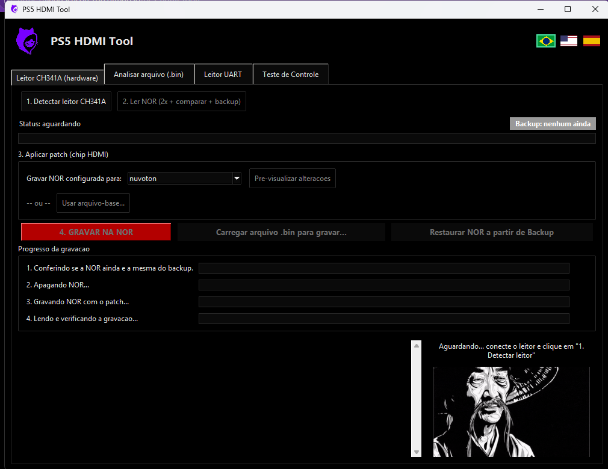

# PS5 HDMI Tool

🌐 **[Read in English](README.en.md)**

Desenvolvido por **DatZero Foundation** — [datzerogames.com.br](https://datzerogames.com.br/)
Técnico criador: **Jefferson Honorio**

🔗 **[Site do projeto](https://vendashson-rgb.github.io/ps5-hdmi-tool/)**



## 🎯 Para que serve

**PS5 HDMI Tool** é uma ferramenta de software que **aplica um patch no arquivo
`.bin` da memória NOR da placa de um PS5 Slim**, tornando possível instalar um
chip HDMI da **Nuvoton (MN864739)** em placas que originalmente exigem um chip
**Realtek (RTD2175P)** — e vice-versa. Ou seja: conversão/troca de CI HDMI
(chip HDMI) do PS5 Slim por reaproveitamento de componente, uma alternativa
quando o chip Realtek original está em falta ou inviável de encontrar no
mercado de reposição.

Esta ferramenta é a parte **software** do processo. A parte física (a troca
do chip em si, via retrabalho/microssoldagem) é feita com o
**[Interposer DatZero](docs/GUIA_INSTALACAO_INTERPOSER.md)** — veja o guia
completo de instalação física, com lista de ferramentas e fotos passo a
passo. O programa e o Interposer são complementares: o Interposer resolve a
parte elétrica/física do CI HDMI (incluindo regulador de tensão dedicado, ver
seção no guia), e o PS5 HDMI Tool resolve a parte da NOR (ler, gravar e
converter o firmware da placa pro novo chip).

**Busca relacionada:** conserto PS5 HDMI, reparo placa PS5 sem imagem/sem
vídeo, troca chip HDMI PS5, Realtek RTD2175P sem estoque, substituir RTD2175P
por MN864739, Nuvoton MN864739 no lugar do Realtek, programador CH341A PS5,
leitura e gravação de NOR PS5, patch de NOR PS5, interposer HDMI PS5 Slim.

**Testado com hardware real:** leitor CH341A testado em bancada real — leitura
e gravação de NOR funcionando corretamente (confirmado pelo criador do
projeto).

## ⬇️ Baixar

**[Baixar o instalador (.exe) — última versão](https://github.com/vendashson-rgb/ps5-hdmi-tool/releases/latest)**

Baixe o `PS5_HDMI_Tool_Setup.exe` da página de releases acima e rode — ele
instala o programa e o driver do leitor CH341A automaticamente (pede
permissão de administrador pra isso). Não precisa instalar Python nem nada
além dele.

Depois de instalado, o próprio programa confere sozinho (alguns segundos
depois de abrir) se há uma versão mais nova publicada no GitHub — se
houver, mostra um aviso perguntando se quer baixar e instalar agora; se
aceitar, ele baixa o instalador novo, abre ele e fecha sozinho, sem
precisar baixar nada manualmente de novo. Falha de internet nessa checagem
é ignorada em silêncio (não atrapalha o uso normal do programa).

Programa para ler/gravar a NOR de placas PS5 Slim via leitor CH341A, conferir
a leitura, salvar backup automático, mostrar informações da placa (chip HDMI
instalado, MAC, dados de identificação) e aplicar o patch de conversão de
chip HDMI (Realtek ⇄ Nuvoton/Panasonic).

Esta ferramenta é o lado **software** da conversão de CI HDMI. Pra fazer a
troca física do chip numa placa real usando o **Interposer DatZero**, veja
**[docs/GUIA_INSTALACAO_INTERPOSER.md](docs/GUIA_INSTALACAO_INTERPOSER.md)**
— guia destinado a técnicos avançados em bancada/microssoldagem, com a lista
de ferramentas, fotos de localização do chip e o procedimento completo.

**Atenção ao checksum em 0x1C41FE-0x1C41FF:** descobrimos que ele é uma
tabela fixa por (chip HDMI + revisão do módulo Wi-Fi), não depende do MAC —
ver `NOTES.md`. Só está resolvido para as combinações já vistas em amostras
reais; para uma combinação nova o programa avisa e mantém o valor antigo —
nesse caso, grave **somente em placa de bancada/teste**, nunca em placa de
cliente, até surgir uma amostra real que confirme o valor certo.

## Idioma do programa

O programa tem três bandeirinhas no canto superior direito (🇧🇷/🇺🇸/🇪🇸) —
clique em uma pra trocar o idioma da interface na hora, sem reiniciar:
**português, inglês ou espanhol**. Toda a interface (botões, abas, mensagens
de confirmação/erro e o log de atividade) é traduzida — ver `i18n.py`.

## ⚠️ Problema de 32 bits x 64 bits (leia antes de rodar)

A `CH341DLL.dll` usada pelo leitor CH341A só existe em versão **32 bits**
(confirmado: nem o Windows nem o driver trazem uma versão de 64 bits dela).
Se você rodar este programa com um Python de 64 bits (o mais comum hoje em
dia), vai dar erro ao tentar carregar a DLL.

**Solução: instalar um Python de 32 bits, só para rodar este programa.**

1. Acesse https://www.python.org/downloads/windows/ (site oficial).
2. Baixe a versão **"Windows installer (32-bit)"** de uma versão 3.11.x (ou
   próxima da que você já tem).
3. Rode o instalador. Pode instalar normalmente, sem desinstalar o Python de
   64 bits que você já tem — os dois convivem.
4. Depois de instalado, abra um **novo** PowerShell na pasta do programa e
   rode:
   ```
   py -0p
   ```
   Isso deve listar duas versões do Python, uma marcada como 32-bit.
5. Rode o programa especificando a versão de 32 bits, por exemplo:
   ```
   py -3.11-32 main.py
   ```
   (o nome exato depende do que apareceu no passo 4 -- pode ser
   `-3.11-32` ou algo parecido).

Se `py -0p` não mostrar nenhuma versão de 32 bits mesmo depois de instalar,
me avise com o que apareceu que eu ajudo a identificar o caminho certo do
`python.exe` de 32 bits pra rodar diretamente por ele.

## Pré-requisitos

1. **Python 3.10+** instalado (inclui Tkinter por padrão no instalador oficial do Windows).
2. **Driver do leitor CH341A instalado.** Os arquivos do driver já estão
   dentro da pasta `drives/` deste programa (`CH341WDM.INF/.SYS/.CAT`,
   `CH341W64.SYS`, `CH341DLL.dll`). Se o NeoProgrammer já funciona na sua
   máquina, o driver já está instalado e pode pular este passo. Senão:
   - Conecte o leitor CH341A na USB.
   - Abra o Gerenciador de Dispositivos; se aparecer com um aviso/
     interrogação amarela, clique com o botão direito → **Atualizar
     driver** → **Procurar driver no computador** → aponte para a pasta
     `drives/` deste programa.
   - Veja `drives/CH341A_install.png` como referência visual da instalação.
3. **Bibliotecas Python** (Pillow para as animações, pyserial para a aba
   UART, hidapi para a aba de teste de controle). Instale com:
   ```
   pip install -r requirements.txt
   ```
   (se estiver usando o Python de 32 bits por causa da `CH341DLL.dll`, veja
   a seção abaixo, rode esse comando com `py -3.11-32 -m pip install -r requirements.txt`).
4. **Adaptador USB-serial** (opcional, só pra aba "Leitor UART") ligado nos
   pinos de debug da placa. Confira a tensão do adaptador antes de conectar.
5. **Controle DualSense** (opcional, só pra aba "Teste de Controle") ligado
   por cabo USB.

## Como rodar

```
cd ps5-hdmi-tool
python main.py
```

## Gerar o instalador (pra entregar pro usuário instalar sozinho)

A forma recomendada de entregar o programa é o **instalador** (não o `.exe`
sozinho) — ele resolve o problema do driver do CH341A não ser detectado
automaticamente em outra máquina: instala o programa E registra o driver
direto no Windows (via `pnputil`, que já vem no Windows), sem o usuário
precisar abrir o Gerenciador de Dispositivos.

Passo a passo (depois de gerar o `.exe`, seção abaixo):

```
"C:\Users\<voce>\AppData\Local\Programs\Inno Setup 6\ISCC.exe" installer.iss
```

(primeira vez: instalar o Inno Setup — `winget install JRSoftware.InnoSetup` —
é gratuito e é só a ferramenta de build, o usuário final não precisa dele)

Gera `installer_output\PS5_HDMI_Tool_Setup.exe` — é esse arquivo único que
você manda pro usuário. Ao rodar:

1. Pede permissão de administrador (normal — é necessário pra instalar o
   driver e copiar pra Program Files).
2. Instala o programa em `Program Files\PS5 HDMI Tool\`.
3. Registra o driver do leitor CH341A no Windows automaticamente — na
   próxima vez que o leitor for conectado em qualquer porta USB, o Windows
   já reconhece sozinho, sem pedir pra apontar pasta nenhuma.
4. Cria atalho na área de trabalho e no menu Iniciar.
5. Oferece abrir o programa ao final.

**Não precisa instalar Python na máquina do usuário** — o `.exe` já leva o
Python embutido (gerado com PyInstaller, modo "onedir" — uma pasta com o
`.exe` e seus arquivos de apoio, não um `.exe` único; onedir abre muito
mais rápido que onefile, que precisa se descompactar numa pasta temporária
toda vez que abre).

**Controle DualSense (aba "Teste de Controle"):** não precisa de driver
separado — é um dispositivo HID USB padrão, e o Windows já tem suporte nativo
a isso desde sempre (mesma categoria de teclado/mouse). Só funciona plugar o
cabo USB e usar.

Os backups de NOR (`database/backups/`) agora ficam em
`%LOCALAPPDATA%\PS5 HDMI Tool\` (não do lado do `.exe`) — isso evita falha
silenciosa de permissão quando o programa está instalado em Program Files
(usuário comum não tem permissão de escrita lá sem admin).

## Gerar o .exe (passo usado pelo instalador acima, ou pra testar sozinho)

Gerado com PyInstaller, a partir do mesmo Python de 32 bits usado pra rodar o
programa (precisa ser 32 bits por causa da `CH341DLL.dll`):

```
py -3.11-32 -m pip install pyinstaller
py -3.11-32 -m PyInstaller PS5_HDMI_Tool.spec
```

(na primeira vez, se não existir o `.spec`, use o comando completo:
`py -3.11-32 -m PyInstaller main.py --name "PS5_HDMI_Tool" --onedir --icon images/icon.ico --add-data "images;images" --add-data "drives;drives"`
— **não** use `--onefile`: deixa o programa bem mais lento pra abrir, porque
precisa se descompactar numa pasta temporária toda vez)

O `.exe` final fica em `dist/PS5_HDMI_Tool/PS5_HDMI_Tool.exe`, dentro de uma
pasta com os arquivos de apoio dele (`_internal/` etc.) — é essa pasta
inteira que precisa ser copiada/distribuída junto, não só o `.exe` sozinho.
Pra rodar direto assim (sem o instalador), copie também a pasta `drives/`
pra dentro de `dist/PS5_HDMI_Tool/` — se o Windows não detectar o leitor
CH341A sozinho, aponte manualmente pra essa pasta no Gerenciador de
Dispositivos. **Pra entregar pra um usuário final, prefira sempre o
instalador** (seção acima) — ele já cuida do driver sozinho.

O `.exe` roda só com a janela do programa (`console=False` no `.spec`) —
sem console/janela preta junto. Como não tem console pra mostrar erro na
tela, qualquer exceção não tratada é logada automaticamente em
`%LOCALAPPDATA%\PS5 HDMI Tool\crash.log` (ver `main.py`) e também mostra um
aviso na tela avisando onde olhar — então ainda dá pra depurar problemas
mesmo sem o console visível.

## Fluxo de uso

1. Conecte o leitor CH341A com a NOR no soquete/clipe.
2. Clique em **"1. Detectar leitor CH341A"**. O programa lê o JEDEC ID do
   chip de flash e já identifica se é a Winbond W25Q16JV (2 MB) esperada
   nas placas de PS5 — se for outro modelo da Winbond ou outro fabricante,
   avisa no log pra você conferir se é o chip certo antes de prosseguir.
3. Clique em **"2. Ler NOR"**. O programa:
   - Lê a NOR inteira duas vezes e compara byte a byte.
   - Se as duas leituras não baterem, avisa e **não** salva nada — refaça o
     contato do leitor e tente de novo.
   - Se baterem, confere se o conteúdo é mesmo uma NOR de PS5: se vier 100%
     vazio (0xFF), avisa que provavelmente não há NOR no soquete/clipe (mau
     contato); se tiver dado mas não tiver a assinatura de uma NOR de PS5,
     avisa que ela está corrompida ou é de outro tipo de chip. Nos dois
     casos, **não** salva nada e não trata como leitura válida.
   - Se baterem e forem uma NOR de PS5 válida, salva as duas leituras em
     `database/backups/<identificador_do_console>/DUMP1.bin` e `DUMP2.bin`
     e mostra as informações da placa. Cada console tem sua própria subpasta
     (uma leitura nova do mesmo console sobrescreve `DUMP1.bin`/`DUMP2.bin`
     anteriores).
4. Clique em **"Pré-visualizar alterações"** (passo 3) pra ver o patch de
   conversão de chip HDMI — isso também salva o resultado já convertido na
   mesma pasta do console, como `REALTEK_FOR_NUVOTON.bin` (ou
   `NUVOTON_FOR_REALTEK.bin`, dependendo do sentido da conversão).
4b. **"Usar arquivo-base..."** (ao lado do passo 3): alternativa pra quando
   você já tem um arquivo-base `.bin` completo (2 MB) de outro console, já
   configurado com o chip HDMI e a família de placa certos — o programa
   reaproveita as informações do console que você acabou de ler (número de
   série e endereços MAC) e grava por cima do arquivo-base, mantendo o
   resto dele como está. Mostra o chip/família detectados no arquivo-base e
   pede confirmação antes de prosseguir — confira se batem com o que você
   pretende instalar. Depois é só clicar em "Gravar na NOR" normalmente.
5. Para gravar qualquer `.bin` de 2 MB válido na NOR conectada — um backup
   salvo anteriormente, ou um arquivo convertido na aba "Analisar arquivo
   (.bin)" (patch de chip, arquivo-base, tipo de console) — use o botão
   **"Carregar arquivo .bin para gravar..."**. Fica disponível assim que o
   leitor é detectado (não precisa ler a placa antes). Só o tamanho (2 MB) e
   a assinatura de uma NOR de PS5 são conferidos ali; o programa então
   carrega o arquivo e mostra todas as informações dele, igual já faz depois
   de ler a placa de verdade — ele **não** grava nada ainda. A gravação só
   acontece quando você clicar em **"4. GRAVAR NA NOR"**, igual ao fluxo
   normal de ler+pré-visualizar.
6. Ao clicar em **"4. GRAVAR NA NOR"**, se você ainda não tiver feito nenhum
   backup nesta sessão (nem pelo passo 2, nem carregando um arquivo sem
   antes ler a placa), o programa avisa que, sem backup, a gravação será
   irreversível, e oferece fazer um backup automático agora (duas leituras
   da NOR atual) antes de continuar.
7. **"Restaurar NOR a partir de Backup"**: grava de volta, com a mesma
   dupla confirmação, o último backup feito nesta sessão (do passo 2, ou o
   automático oferecido no passo 6). Se nenhum backup tiver sido feito
   ainda, avisa em vez de tentar gravar.

## Aba "Analisar arquivo (.bin)"

Não depende do leitor CH341A conectado. Deixa escolher qualquer `.bin` de
2 MB salvo no PC (de um backup antigo, de outra ferramenta, etc.), analisa na
hora (chip HDMI, MAC, CFI, etc.) e permite pré-visualizar e salvar um novo
arquivo já com o patch aplicado — sem tocar em nenhuma placa.

Se o arquivo analisado for de uma família de placa com arquivo-base
disponível (ex. EDM-04X, EDM-05X), o botão **"Usar arquivo-base
automático"** fica habilitado: o programa já sabe qual arquivo-base usar pra
aquela família, reaproveita o número de série e os endereços MAC do arquivo
aberto e grava por cima do arquivo-base automaticamente (mesma lógica do
botão "Usar arquivo-base..." da aba de hardware, só que escolhendo o
arquivo-base certo sozinho em vez de pedir pra você selecionar um).

Se o arquivo estiver corrompido ou totalmente em branco (leitura que não
trouxe dado nenhum — o programa avisa isso claramente no log) e por isso a
família não puder ser detectada automaticamente, use o botão **"Regenerar
com arquivo-base..."**: você escolhe manualmente o arquivo-base certo (pelo
modelo impresso na própria placa) e o programa grava por cima dele só os
dados que conseguir aproveitar do arquivo original — os campos que não têm
dado válido são mantidos como já estavam no arquivo-base, em vez de serem
apagados.

**Converter tipo de console (Disco / Digital / Edição Slim)**: campo
usado pelo sistema pra decidir se exige o leitor de disco físico. Útil
principalmente pra PS5 "Fat" (EDM-01X a EDM-03X) com o leitor de disco
com defeito — como ele é pareado com a APU e não dá pra trocar por outro,
convertendo o console pra "Digital" o sistema para de exigi-lo e volta a
atualizar normalmente. Escolha o tipo de destino no menu e clique em
"Converter"; o resultado precisa ser salvo (botão "Salvar NOR com
patch...") e gravado numa placa de bancada/teste antes de confiar em
cliente.

## Aba "Leitor UART"

Captura o log bruto de um adaptador USB-serial ligado nos pinos de debug da
placa, pra ajudar a levantar códigos de erro em consoles que não ligam.
**Não interpreta nem traduz os códigos** — só mostra o texto cru (colorindo
automaticamente linhas que parecem erro/aviso/sucesso, por palavras-chave) e
deixa salvar o log capturado em `.txt`. Baud padrão: 115200 (o mais comum em
debug UART) — se não vier nada legível, teste outros valores no menu de baud.
Confira a tensão do adaptador antes de ligar (muita placa embarcada usa
3.3V TTL).

**"Ler códigos de erro"**: depois de conectar, envia o comando ativo
`errlog N` (N de 0 a 10) pro console, pra consultar os códigos de erro já
gravados sem precisar religar e capturar o boot inteiro. **"Limpar códigos
de erro no console"** envia `errlog clear` (pede confirmação — apaga o
histórico gravado no console, não pode ser desfeito). Protocolo conferido
contra o código-fonte do [PS5 NOR Modifier](https://github.com/TheCod3rYouTube/PS5NorModifier)
(TheCod3r) — **ainda não testado com hardware real neste projeto**. Se não
vier resposta nenhuma, confira o baud e a pinagem antes de desconfiar do
comando em si.

## Aba "Teste de Controle"

Teste de controle DualSense/DualSense Edge **nativo** (sem internet, sem
navegador — inspirado no dualshock-tools.github.io, mas lido direto via HID
no programa). Conecte o controle por **cabo USB**, clique em "Detectar
controle" e depois "Conectar". Mostra em tempo real:

- Posição dos dois analógicos (bolinha + valores brutos — útil pra detectar *drift*).
- Um **diagrama do controle** que acende em verde cada botão/gatilho/D-pad/
  touchpad conforme é apertado (gatilhos mostram a porcentagem de pressão).
- Touchpad (pontinhos de até 2 dedos), bateria, teste de vibração e teste da
  barra de luz (cores).
- **Calibração do analógico** (centro e alcance), gravada direto na memória
  do controle — o mesmo recurso do dualshock-tools.github.io. Clique em
  "Calibrar centro" (solte os sticks antes) ou "Calibrar alcance..." (gire os
  dois analógicos em círculos completos quando pedir). As mudanças só ficam
  permanentes depois que você clicar em "Salvar alterações permanentemente" —
  até lá dá pra testar e desistir sem risco.

**Nível de confiança:** analógicos/gatilhos/botões/D-pad/vibração/barra de
luz/calibração foram conferidos diretamente contra o código-fonte real de
dois projetos open-source (pydualsense e dualshock-tools.github.io, ambos
MIT) — alta confiança, mas **ainda não testados com um controle real neste
projeto**. Touchpad e bateria são os campos mais sensíveis a variação de
firmware. Teste com seu controle e me avise exatamente o que funcionou ou
veio errado, que eu ajusto os offsets.

## ✅ Testado com hardware real

A camada de comunicação com o CH341A (`ch341_spi.py`) foi validada em bancada
com um leitor CH341A real: **leitura e gravação de NOR confirmadas
funcionando corretamente**.

## Estrutura do projeto

Código do programa (ficam na raiz):
- `nor_parser.py` — interpretação do conteúdo da NOR (chip, MAC, etc.). Testado contra 6 dumps reais.
- `nor_patcher.py` — gera o patch de conversão Realtek ⇄ Nuvoton/Panasonic.
- `ch341_spi.py` — comunicação com o leitor CH341A (**testado e confirmado com hardware real** — leitura e gravação de NOR funcionando).
- `uart_reader.py` — captura da porta serial/UART (aba "Leitor UART"). **Ainda não testado com um adaptador real.**
- `dualsense.py` — leitura/teste de controle DualSense via HID bruto (aba "Teste de Controle"). **Ainda não testado com um controle real.**
- `gif_anim.py` — player de animações GIF usado na interface (carregamento preguiçoso — só decodifica os frames de um estágio na primeira vez que ele realmente aparece na tela).
- `i18n.py` — traduções da interface (português/inglês/espanhol) e o seletor de idioma ativo.
- `version.py` — número da versão atual (fonte única, usada pela checagem de atualização).
- `updater.py` — checagem e download de atualizações via GitHub Releases.
- `gui.py` — interface gráfica (Tkinter).
- `main.py` — ponto de entrada (`python main.py`).
- `requirements.txt` — dependências Python (Pillow, pyserial, hidapi).
- `NOTES.md` — mapa de offsets confirmados e pendências.
- `PS5_HDMI_Tool.spec` — receita do PyInstaller pra gerar `dist/PS5_HDMI_Tool/` (onedir).
- `installer.iss` — receita do Inno Setup pra gerar o instalador final (`installer_output/PS5_HDMI_Tool_Setup.exe`), a partir do `.exe` já gerado.
- `docs/GUIA_INSTALACAO_INTERPOSER.md` — guia de instalação física do Interposer DatZero (retrabalho de hardware, não é sobre o programa). `docs/assets/` tem as imagens usadas nele (ferramentas, interposer, localização do chip na placa).

Pastas de apoio (tudo que o programa precisa para rodar na máquina do usuário):
- `images/` — logo, ícone e todas as animações (`.gif`) mostradas na interface.
  `images/controller/` tem o diagrama do controle (fundo + um recorte
  transparente por botão) usado na aba "Teste de Controle". `images/flags/`
  tem as bandeirinhas (pt/en/es) do seletor de idioma.
- `drives/` — driver do leitor CH341A (`CH341WDM.*`, `CH341W64.SYS`) e a
  `CH341DLL.dll` usada pelo programa para falar com o leitor. O instalador
  registra esse driver automaticamente no Windows (seção "Gerar o
  instalador" acima) — não precisa de nenhum driver separado pro controle
  DualSense (é HID USB padrão, já suportado nativamente pelo Windows).
- `database/backups/<identificador_do_console>/` — uma subpasta por console
  (pelo identificador lido da própria NOR), contendo `DUMP1.bin` (1ª
  leitura), `DUMP2.bin` (2ª leitura, pra conferência) e, depois de
  pré-visualizar um patch, `REALTEK_FOR_NUVOTON.bin` ou
  `NUVOTON_FOR_REALTEK.bin` (NOR já convertida). Local real em
  `%LOCALAPPDATA%\PS5 HDMI Tool\database\backups\` quando instalado via
  instalador.

Scripts de desenvolvimento (não são necessários para o usuário final rodar o
programa, só para quem está desenvolvendo/depurando):
- `dev_tools/test_parser_manual.py` — conferência rápida do parser contra dumps já coletados.
- `dev_tools/verify_patch_against_real.py` — valida o patch contra uma conversão real conhecida.
- `dev_tools/find_wifi_rev.py` / `dev_tools/search_version.py` — scripts de pesquisa de offsets.
- `dev_tools/diag_find_chunk.py` — descobre o tamanho de bloco de transferência SPI que funciona com o leitor.
- `dev_tools/make_icon.py` — gera `images/icon.ico` a partir de `images/logo.png`.
- `dev_tools/build_flags.py` — gera `images/flags/*.png` (bandeiras do seletor de idioma).
- `dev_tools/build_controller_diagram.py` — gera `images/controller/*.png` (diagrama do controle) a
  partir do SVG real do DualSense usado pelo dualshock-tools.github.io
  (`dev_tools/assets_src/dualsense-controller.svg`, MIT). Só precisa rodar de novo se trocar o SVG de
  origem — requer `pip install -r dev_tools/requirements-dev.txt` (não é dependência do programa final).
