# Guia de instalação do Interposer DatZero (Realtek RTD2175P → Nuvoton/Panasonic MN864739)

**DatZero Foundation** — [datzerogames.com.br](https://datzerogames.com.br/)
Técnico criador: **Jefferson Honorio**

---

## ⚠️ Para quem é este guia

Este guia é destinado **exclusivamente a técnicos de videogame de nível
avançado em bancada e microssoldagem**. Não é um tutorial de introdução à
solda nem ao reparo de PS5.

Pré-requisitos obrigatórios para seguir este guia com segurança:

- **Experiência comprovada em microssoldagem SMD/QFN** (remoção e
  instalação de componentes de passo fino com estação de ar quente e ferro
  de precisão). Este guia **não ensina técnica de retrabalho** — pressupõe
  que você já domina isso.
- **Conhecimento em gravação/leitura de BIOS/NOR SPI** (uso de
  programadores tipo CH341A, interpretação de dumps, backup antes de
  gravar). Se você nunca gravou uma NOR SPI antes, não comece por aqui.
- **Posse física do Interposer DatZero** para a conversão
  RTD2175P → MN864739. Este guia não funciona sem a peça — o interposer é
  uma placa intermediária fabricada especificamente para este encaixe, não
  é possível improvisar a ligação direto no CI.
- Bancada com ESD controlado (pulseira/tapete aterrados), boa iluminação e
  magnificação (microscópio ou lupa binocular).

Executar este procedimento sem o preparo acima tem alto risco de **perda
total da placa-mãe**. A DatZero Foundation não se responsabiliza por danos
decorrentes de execução por pessoa sem a qualificação necessária.

---

## O que esse interposer faz

O Interposer DatZero substitui o CI HDMI **Realtek RTD2175P** original da
placa por um **Nuvoton/Panasonic MN864739**, sem precisar redesenhar a
trilha da placa-mãe: ele tem o footprint do RTD2175P na face de baixo (solda
nos mesmos pads onde o Realtek estava) e o footprint do MN864739 na face de
cima (onde o novo chip é soldado). Os componentes passivos de suporte
(capacitores C1–C7 e o regulador U1) já vêm montados na placa do interposer.

| Face de baixo (solda na placa-mãe) | Face de cima (recebe o MN864739) | Layout interno |
|---|---|---|
| 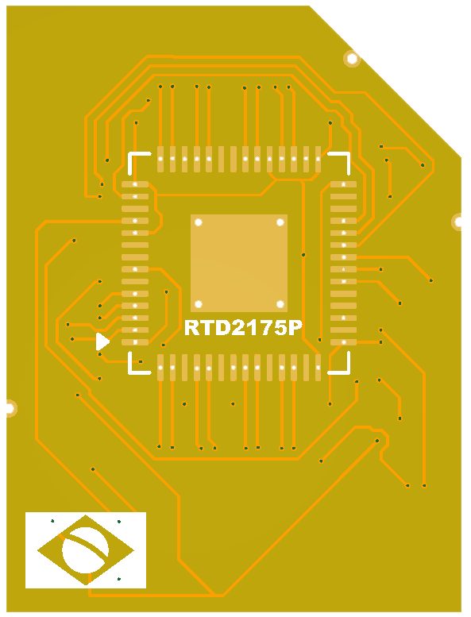 | 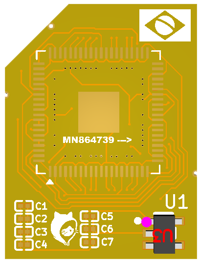 | 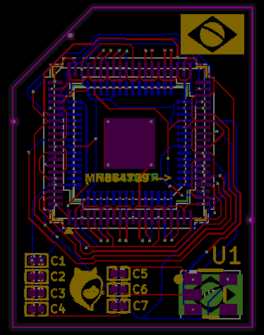 |

**Orientação (pino 1):** tanto a face de baixo quanto a de cima têm uma
marcação triangular no mesmo canto — alinhe sempre essa marcação com o
indicador de pino 1 do footprint original na placa-mãe e com o pino 1 do
MN864739. A seta "MN864739 --->" serigrafada na face de cima indica o
sentido de montagem do chip novo.

### Regulador de 1,8V integrado (TI TLV71318PDBVR) — por que isso importa

O MN864739 precisa de **duas tensões** pra funcionar: 0,9V e 1,8V. O
RTD2175P que ele substitui também precisa de duas tensões — 0,9V e **3,3V**
— e essa trilha de 3,3V já existe na placa, alimentando o footprint
original. O Interposer DatZero vem com o regulador **U1 (TI
TLV71318PDBVR)** já soldado de fábrica, que aproveita esse 3,3V já existente
e abaixa localmente para os 1,8V que o Nuvoton precisa.

Isso significa que **o interposer não precisa puxar 1,8V de nenhum outro
ponto da placa-mãe**. Essa decisão de projeto existe por um motivo
concreto: o CI HDMI é historicamente uma das peças com maior índice de
defeito/queima no setor de vídeo do PS5. Se a alimentação de 1,8V fosse
puxada de outro ponto da placa — por exemplo, direto do PMIC da APU
(CXD) — uma eventual sobrecarga no setor de vídeo teria caminho livre pra
se propagar e queimar não só o CI HDMI, mas também o PMIC e, na pior
hipótese, a própria APU junto. Com o regulador dedicado e isolado no
próprio interposer, esse caminho de falha fica contido ali, protegendo o
resto da placa.

Além disso, o pino **EN** (habilita saída) do TLV71318PDBVR está ligado à
própria trilha de **0,9V**: o regulador só libera a saída de 1,8V quando a
tensão de 0,9V já está presente, garantindo a sequência de energização
correta do chip sem nenhum componente externo adicional. Isso bate
exatamente com o [datasheet oficial da TI para a série
TLV713](https://www.ti.com/lit/gpn/TLV713): o pino EN liga o regulador ao
ultrapassar **0,9V (mínimo)** e desliga abaixo de **0,4V** — ou seja, a
trilha de 0,9V do próprio Nuvoton é, por especificação, tensão suficiente
pra ligar o regulador de 1,8V.

| Face de cima com o regulador populado |
|---|
|  U1 = TI TLV71318PDBVR (ponto rosa = pino 1) |

**Ficha técnica do regulador** — TLV71318PDBVR, encapsulamento SOT-23-5
([datasheet oficial da TI](https://www.ti.com/lit/gpn/TLV713) ·
[página do componente na LCSC, part C2869099](https://www.lcsc.com/product-detail/C2869099.html)):

| Parâmetro | Valor |
|---|---|
| Tensão de saída | 1,8V fixo |
| Faixa de tensão de entrada | 1,4V – 5,5V |
| Pino EN — liga (mínimo) | 0,9V |
| Pino EN — desliga (máximo) | 0,4V |

---

## Ferramentas e insumos necessários

| | Ferramenta/Insumo | Função no processo |
|---|---|---|
| 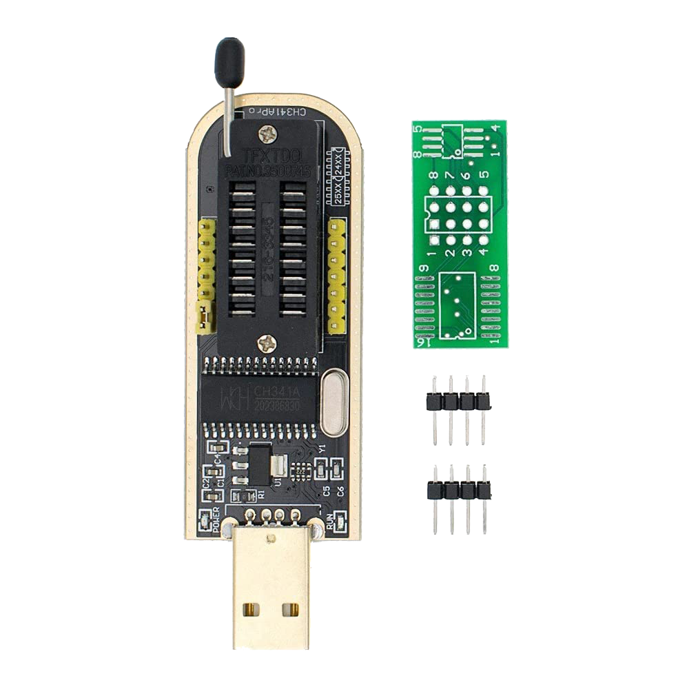 | **Programador CH341A** | Leitura/backup e gravação da NOR SPI da placa-mãe, antes e depois da troca física do CI. |
| — | **Interposer DatZero** (RTD2175P → MN864739) | A peça em si — ver seção acima. |
| — | **Computador com o PS5 HDMI Tool instalado** | Software que lê, converte (Realtek ⇄ Nuvoton) e grava a NOR via CH341A — ver `README.md` deste repositório para instalação. |
| 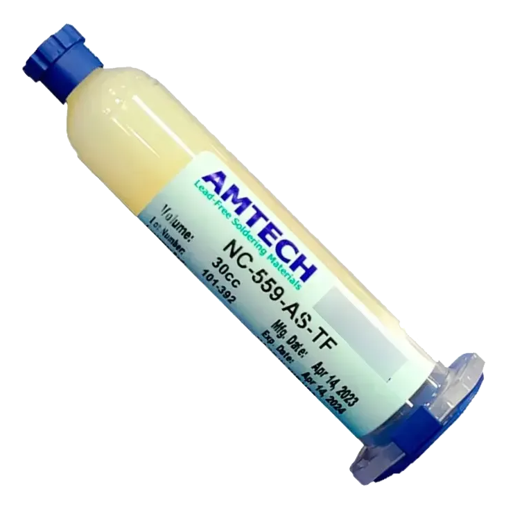 | **Fluxo de solda Amtech NC-559** | Fluxo para remoção do RTD2175P e para a reflow do interposer/MN864739. |
|  | **Pasta de solda 183°C** | Liga de baixa temperatura para fixar o interposer na placa e o MN864739 no interposer sem estressar termicamente os componentes vizinhos. |
| 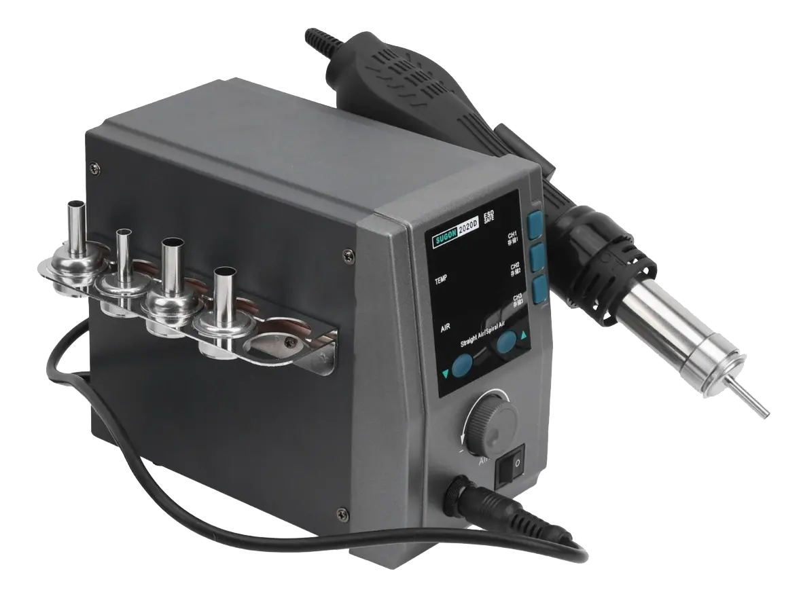 | **Estação de retrabalho a ar quente Sugon 2020D** | Remoção do RTD2175P original e reflow do interposer/chip novo. Perfil de temperatura/vazão conforme sua calibração de bancada. |
| 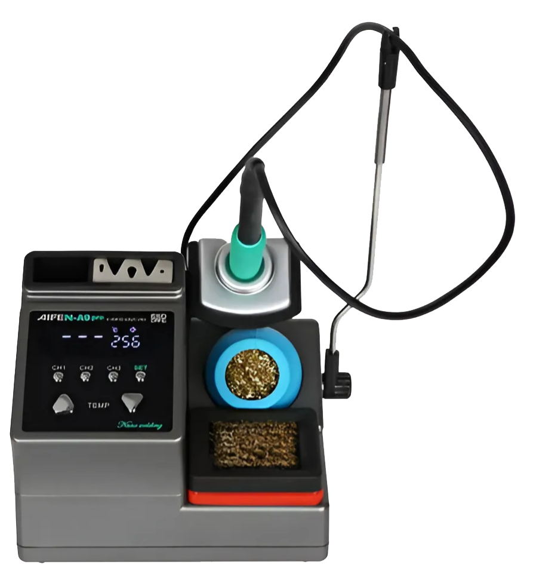 | **Ferro de solda Aifen A9 Pro, ponta C210** | Retoques de precisão, limpeza de pad e acabamento fino nos dois footprints. |

---

## Identificação do CI HDMI na placa

O RTD2175P fica entre a APU (`SIE CXD90069GS`) e o conector HDMI de saída,
numa área com bastante cobre exposto (plano térmico) ao redor:

| Visão geral | Perto do conector | Entre APU e conector | Detalhe |
|---|---|---|---|
| 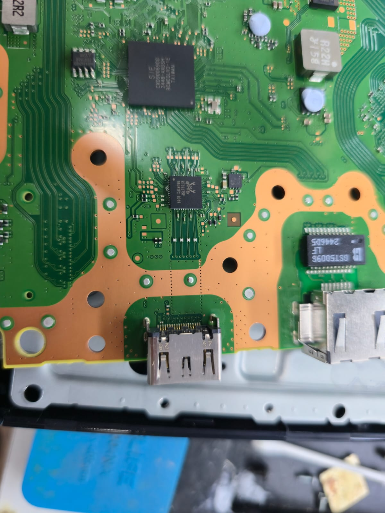 | 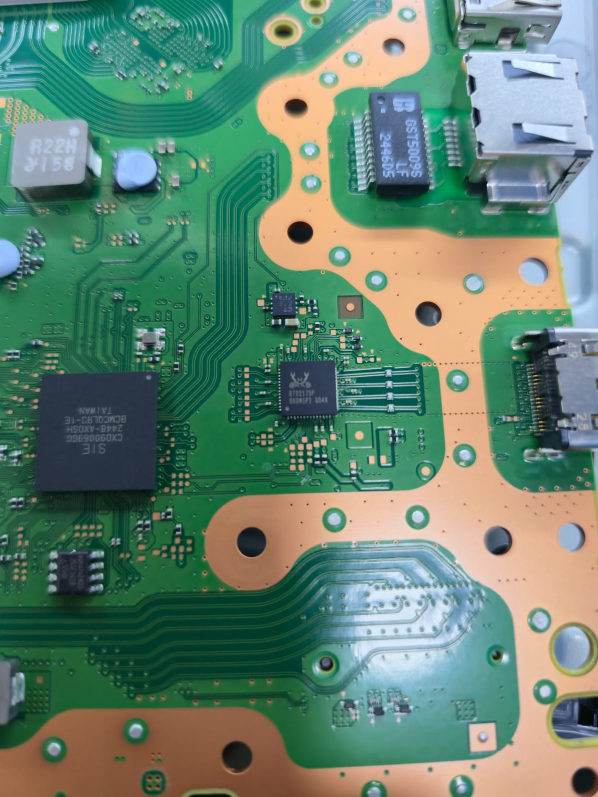 | 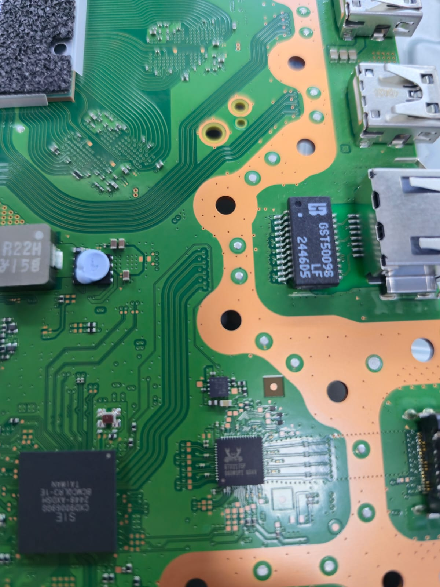 | 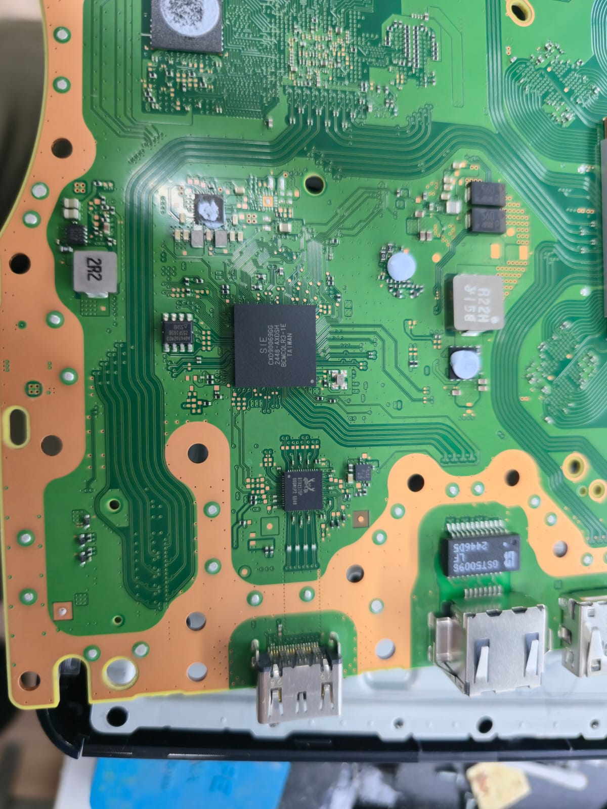 |

| Chip original (remover) | Chip novo (vai no topo do interposer) |
|---|---|
| 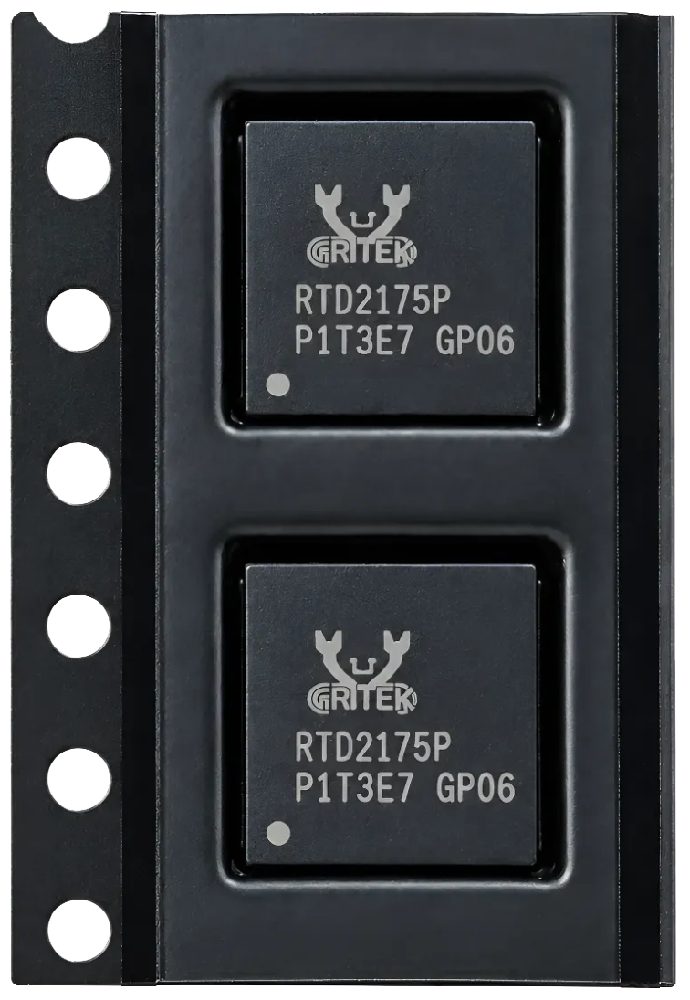 Realtek **RTD2175P** | 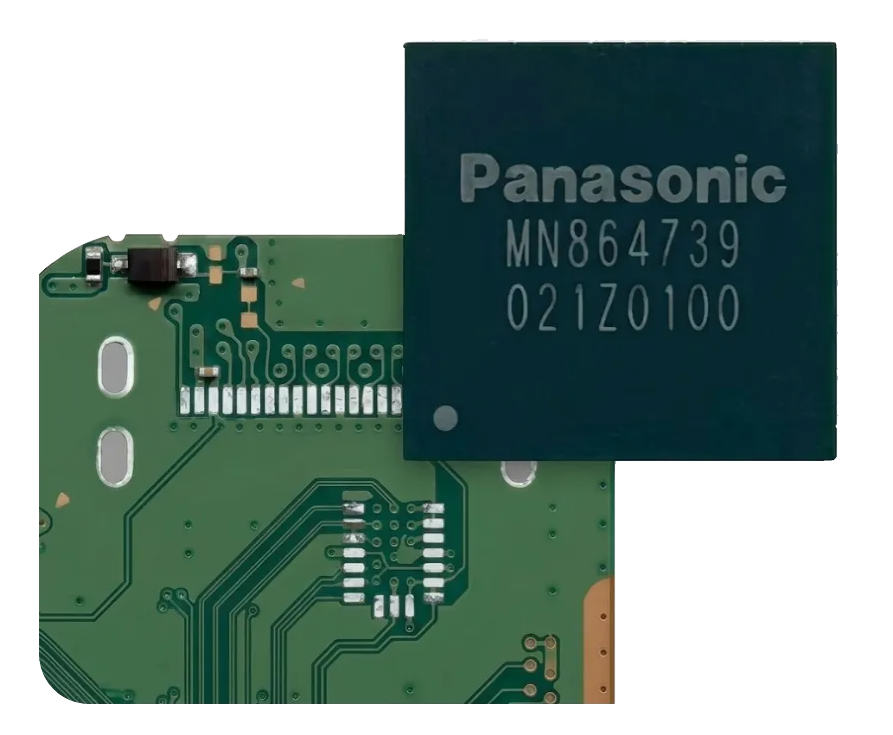 Nuvoton/Panasonic **MN864739** |

Confirme visualmente a marcação `RTD2175P` no próprio chip antes de
desoldar — não confie só na posição, principalmente em placas que já
passaram por retrabalho antes.

---

## Procedimento

Este procedimento intercala etapas de **software** (PS5 HDMI Tool) e de
**hardware** (retrabalho físico). Siga a ordem — gravar a NOR antes da hora
errada é a causa mais comum de "tela azul sem vídeo" depois da conversão.

### 1. Backup da NOR (antes de tocar em qualquer ferro/ar quente)

1. Conecte o CH341A na NOR da placa (ainda com o RTD2175P original) e abra
   o **PS5 HDMI Tool**, aba "Leitor CH341A (hardware)".
2. Clique em **"1. Detectar leitor CH341A"**, depois **"2. Ler NOR"**. O
   programa lê duas vezes, compara, e salva `DUMP1.bin` + `DUMP2.bin` em
   `database/backups/<identificador do console>/`.
3. **Não prossiga para a solda se a leitura não bater** (o programa avisa e
   não salva nada nesse caso) — refaça o contato do leitor primeiro.

### 2. Gerar a conversão (ainda em software, antes da solda)

1. Em **"3. Aplicar patch (chip HDMI)"**, selecione o alvo **nuvoton** e
   clique em **"Pré-visualizar alterações"**.
2. Isso salva automaticamente `REALTEK_FOR_NUVOTON.bin` na mesma pasta do
   backup — é esse arquivo que você vai gravar na placa **depois** da troca
   física do chip (passo 5). Confira no log se o checksum saiu como
   "resolvido" (ver `NOTES.md` deste repositório) — se saiu como "NÃO
   resolvido", pare e consulte o suporte da DatZero antes de prosseguir em
   placa de cliente.
3. **Não clique em "Gravar na NOR" ainda.**

### 3. Remoção do RTD2175P

1. Proteja componentes vizinhos (plástico Kapton) contra o ar quente.
2. Aplique fluxo Amtech NC-559 generosamente sobre o RTD2175P.
3. Remova o chip com a Sugon 2020D, perfil de temperatura adequado à sua
   calibração de bancada para QFN de passo fino.
4. Limpe os pads residuais com o ferro Aifen A9 Pro (ponta C210) até ficarem
   planos e livres de solda em excesso.

### 4. Instalação do interposer

1. Aplique uma fina camada de pasta de solda 183°C nos pads limpos.
2. Posicione o interposer com a face **RTD2175P** voltada para baixo,
   alinhando a marcação de pino 1 (triângulo) com a referência da
   placa-mãe.
3. Faça a reflow com ar quente (Sugon 2020D) até molhar todos os pinos.
   Inspecione sob magnificação: sem solda em ponte, sem pino levantado.
4. Deixe esfriar naturalmente antes de manusear.

### 5. Instalação do MN864739 no interposer

1. Aplique fluxo NC-559 + pasta de solda 183°C na face de cima do
   interposer (footprint `MN864739`).
2. Posicione o MN864739 respeitando a seta/marcação de pino 1 serigrafada.
3. Reflow com ar quente, com cuidado para não deslocar o interposer já
   fixado no passo anterior (temperatura e vazão mais contidas que no
   passo 3/4).
4. Retoque pinos individuais com o ferro de precisão se necessário.

### 6. Inspeção antes de energizar

- Inspeção visual sob magnificação nas duas camadas de solda (placa↔
  interposer e interposer↔MN864739).
- Teste de continuidade/curto com multímetro entre trilhas adjacentes e
  contra o plano de terra, antes de ligar a placa pela primeira vez.

### 7. Gravar a NOR convertida e testar

1. Com a placa já montada (ou em bancada controlada), conecte o CH341A
   novamente na NOR.
2. No PS5 HDMI Tool, use **"Restaurar backup de arquivo..."** e selecione o
   `REALTEK_FOR_NUVOTON.bin` gerado no passo 2 — **esse arquivo já está
   convertido, grave ele agora, não um backup antigo**.
3. Confirme a gravação (o programa pede confirmação dupla + a palavra
   `GRAVAR`), aguarde as 4 etapas (conferir/apagar/gravar/verificar).
4. Ligue a placa e teste a saída de vídeo HDMI.

---

## Problemas comuns

- **Sem vídeo, console liga normal:** suspeite primeiro da solda (pino
  frio, ponte, chip deslocado) antes de mexer na NOR de novo — é a causa
  mais comum nesse tipo de conversão.
- **Console trava na tela de checagem (azul) e não avança:** confira se o
  checksum da conversão (passo 2) saiu "resolvido" para a revisão de Wi-Fi
  dessa placa — ver `NOTES.md`. Se não resolveu, essa pode ser a causa.
- **CH341A não detecta a NOR depois da solda:** confira curto/solda fria
  nos pads do interposer antes de suspeitar do programador — o interposer
  fica numa área adjacente à NOR e um resíduo de fluxo/solda ali pode
  afetar outras linhas da placa.

---

## Aviso legal

Este guia descreve um procedimento de modificação de hardware que anula
qualquer garantia de fábrica do console e envolve risco real de dano
permanente à placa-mãe se executado incorretamente. A DatZero Foundation
fornece o interposer e esta documentação "como estão", sem garantia de
resultado, e não se responsabiliza por danos ao equipamento do cliente
final decorrentes da execução deste procedimento.
